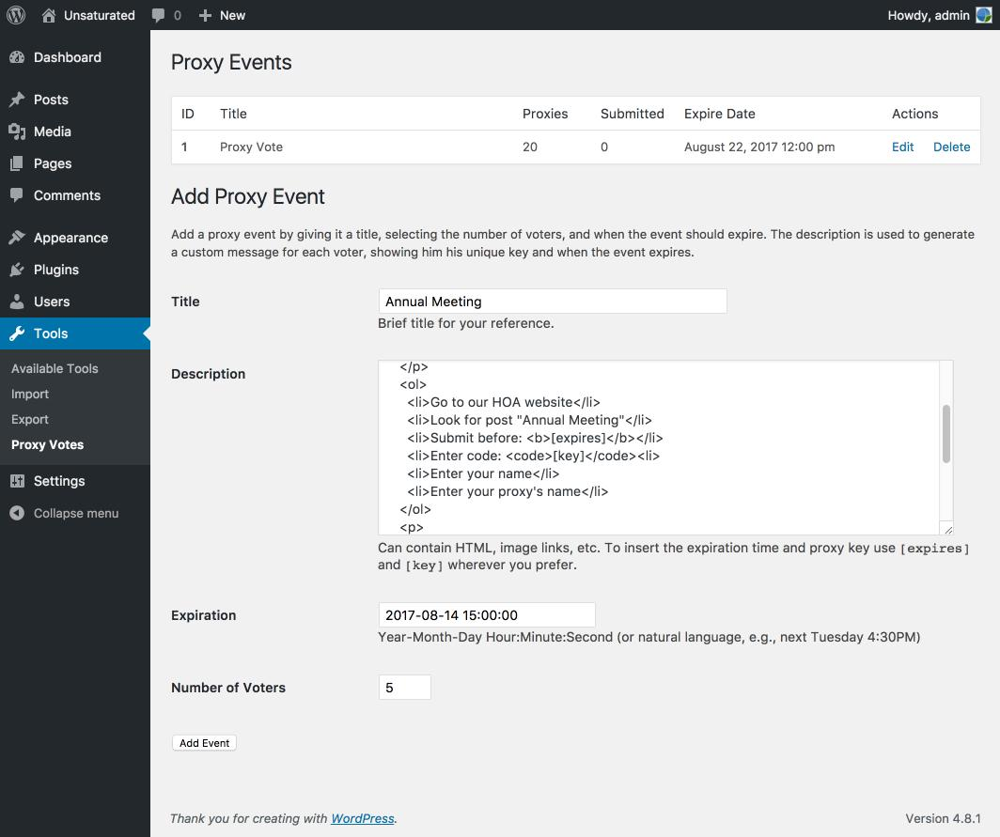
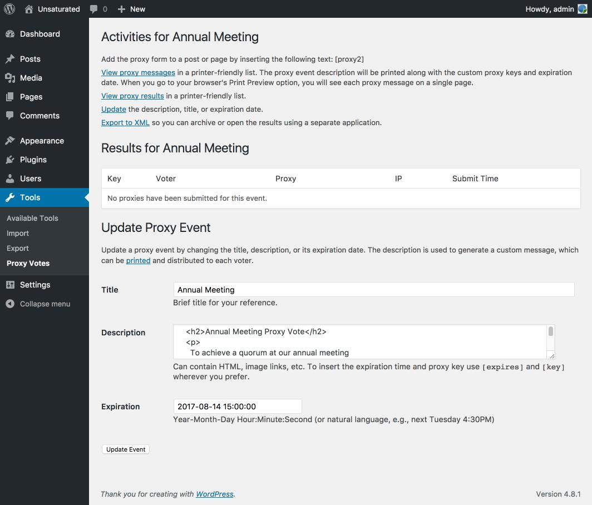
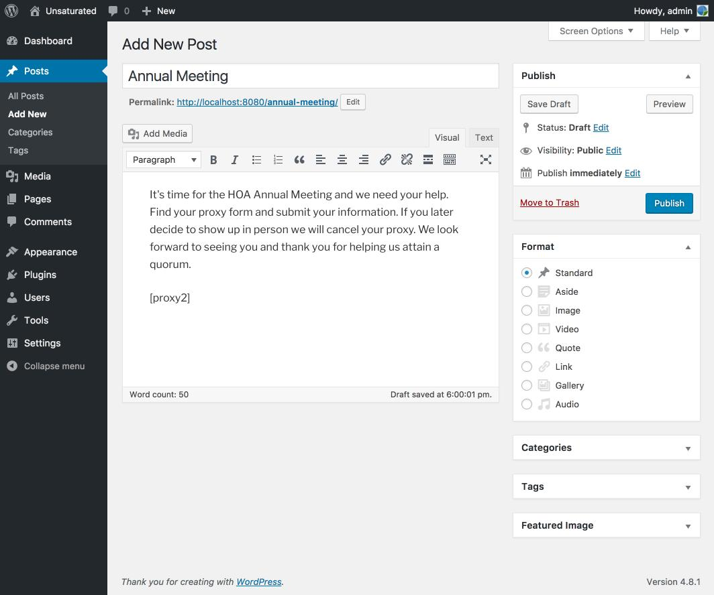
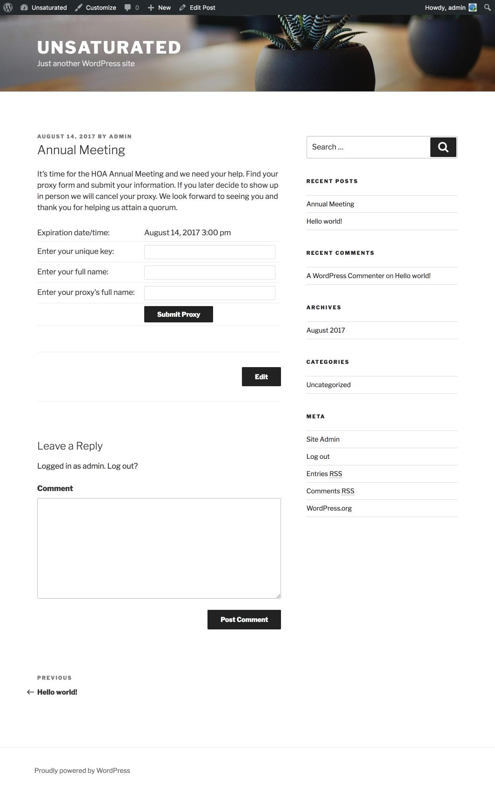

# Proxy Vote
Trying to reach a quorum at your meetings and the traditional methods aren't working? It's time to use the Proxy Vote plug-in for Wordpress. Create voting events, customized flyers, and a page or post to collect the results.

## Installation
  1. Go to **Plugins** -> **Add New**
  2. Click on the **Upload Plugin** button and pick the ZIP file.
  3. Click the **Activate Plugin** button when the plugin has finished uploading.
  4. Go to **Settings** -> **Proxy Vote**; click the **Create Tables** button.
  5. Go to **Tools** -> **Proxy Vote** and you're ready to create an event.

## Features
  * Manage multiple, simultaneous events.
  * Works on old *and* new versions of WordPress: 2.6 through 4.8.
  * Each proxy event description can contain HTML, images, URL links, and more.
  * Event descriptions are formatted to print on individual pages.
  * Customize the form text then insert it with an entry like `[proxy2]`.
  * It works on posts and pages.
  * Information and error messages can be localized to another language very easily.
  * Submitted proxies record the IP address of the sender.
  * Events can be exported to an XML file.

## Anti-Features
  * Events cannot be re-imported to the database from the XML file. Arguably, what's the point when the event has expired?
  * The number of voters cannot be changed once an event is created. Expiration, title, and description _can_ be changed at any time.
  * There is no event start time, only an expiration time. In other words, do not post your event until you are ready to use it.

## Adding an Event
Adding an event is very easy. Provide the title, description, expiration time, and the number of voters. Proxy Vote manages multiple, simultaneous events. 

## Managing Your Event
Once you've created your event, you can monitor its progress, print data, modify its properties, or export the data to XML. Submitted proxies are displayed as they are received. 

## Start Your Event
Ready to post your proxy event form? It's easy. You can add any text before or after the form itself. Give your voters a simple reminder of what's required. Publish your post or page and you're one step closer to a quorum. 

On the proxy details page click _View proxy messages_ and then print the results to a PDF. This event had 5 voters, therefore, 5 unique keys and pages are generated - just print and distribute.

